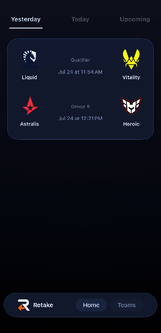

Retake

<p align="center">
  
</p>

Prioritizing live scores similar to the default sports app on iOS.

An Expo (React Native) app for following CS esports matches and teams, with live scores, push notifications, and iOS Live Activities.

## Features

- **Follow teams** — bookmark favorite teams and browse their matches
- **Live scores** — today/yesterday/upcoming match lists with live round-by-round scores (PandaScore + HLTV data via the Retake server)
- **Live Activities (iOS)** — start/stop a Lock Screen Live Activity for a running match from the match details sheet
- **Push notifications** — Expo push token registration wired to the backend for push-to-start Live Activities

## Prerequisites

- Node.js (>= 20)
- npm
- For iOS builds: macOS with Xcode, CocoaPods, and an Apple developer account
- For Android builds: Android Studio / Android SDK

## Setup

### 1. Install dependencies

```sh
npm install
```

### 2. Configure environment variables

Copy/create a `.env` file at the project root:

```sh
# PandaScore API token (https://pandascore.co)
EXPO_PUBLIC_PANDASCORE_TOKEN=your_token_here

# Retake backend server (proxies PandaScore/HLTV and handles push-to-start Live Activities)
EXPO_PUBLIC_RETAKE_SERVER_URL=http://your-server:3003
LOCAL_API_URL=http://your-server:3003
```

### 3. Start the development server

```sh
npm start
```

Press `i` for iOS, `a` for Android, or `w` for web.

## Building

### iOS (with Live Activities)

Live Activities require the native project, including the `LiveActivityWidget` extension target.

```sh
# 1. Install CocoaPods dependencies
cd ios && pod install && cd ..

# 2. Build and run on a simulator or device
npm run ios
```

> **Note:** The `ios/` directory is a committed native project. The widget target was added manually with `scripts/add-widget.py`. **Do not run `npx expo prebuild`** — it regenerates the native project and wipes the widget target. If you do, re-run `scripts/add-widget.py` afterward.

### Android

```sh
npm run android
```

### Web

```sh
npm run web
```

### Lint / typecheck

```sh
npm run lint
npx tsc --noEmit
```

### EAS (Expo Application Services)

Profiles are configured in `eas.json` (`development`, `preview`, `production`):

```sh
eas build --profile production
eas submit --platform ios --profile production
```

## Live Activities

- The widget UI lives in `src/widgets/MatchActivity.tsx` and is rendered natively via `expo-widgets`.
- The start/stop toggle is in `src/components/ui/MatchDetailsModal.tsx` (see `src/hooks/use-live-activity.tsx`).
- The native `LiveActivityWidget` extension target is defined in `ios/Retake.xcodeproj/project.pbxproj`; the build settings reference `ios/LiveActivityWidget/`.
- Live Activities are **iOS-only** (requires iOS 16.2+); Android and web ignore them.
- The backend must handle `POST /server/notif/request` to push content updates to the activity via APNs.

## Project structure

```
src/
  api/          # PandaScore/HLTV API clients + notification helpers
  app/          # expo-router screens (index, teams, root layout)
  components/   # UI components (match views, modals, tabs)
  hooks/        # use-favorites, use-theme, use-live-activity
  widgets/      # iOS Live Activity widget definitions
scripts/        # add-widget.py — adds the widget target to the Xcode project
ios/            # Committed iOS native project (includes LiveActivityWidget target)
android/        # Committed Android native project
```

## Roadmap

- [X] Following teams
- [X] Live scores (PandaScore + HLTV round scores)
- [ ] Notifications
  - [X] Push permission + Expo push token registration
  - [ ] Full notification preferences (start/end of match, highlights)
- [ ] Live Activities — **priority**
  - [X] Widget UI (`MatchActivity.tsx`)
  - [X] Widget extension target in the iOS project
  - [X] Start/stop toggle in match details
  - [ ] Live content updates pushed from the backend (`POST /server/notif/request`)
  - [ ] Verify on-device build + App Store approval (push-to-start entitlement)
